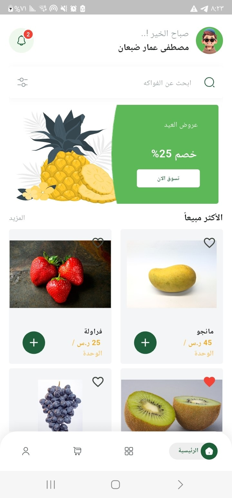

# 🛒 FruitHub E-Commerce App

A modern, fast, and responsive Flutter E-Commerce mobile application tailored for the FruitHub ecosystem. Built with Clean Architecture and BLoC for predictable state management.

## 📸 Screenshots

| Home & Browse | Product Details | Cart & Checkout |
|---------------|-----------------|-----------------|
|  |  |  |

## ✨ Features

- **Product Browsing**: Clean and intuitive UI to browse fresh products.
- **Shopping Cart**: Real-time cart management with quantity adjustments.
- **Secure Checkout**: Seamless checkout flow integrated with modern payment gateways.
- **State Management**: Built with BLoC pattern for a robust and scalable architecture.
- **API Integration**: Fetches real-time data seamlessly using Dio.

## 🛠️ Technology Stack

- **Framework**: [Flutter](https://flutter.dev/)
- **State Management**: flutter_bloc
- **Networking**: dio
- **Architecture**: Clean Architecture / MVVM

## 🚀 Getting Started

1. Ensure you have Flutter installed.
2. Clone this repository:
   `ash
   git clone https://github.com/MustafaAmmarD/fruts_e_commerce.git
   `
3. Install dependencies:
   `ash
   flutter pub get
   `
4. Run the app:
   `ash
   flutter run
   `

## 📄 License

This project is licensed under the MIT License.
